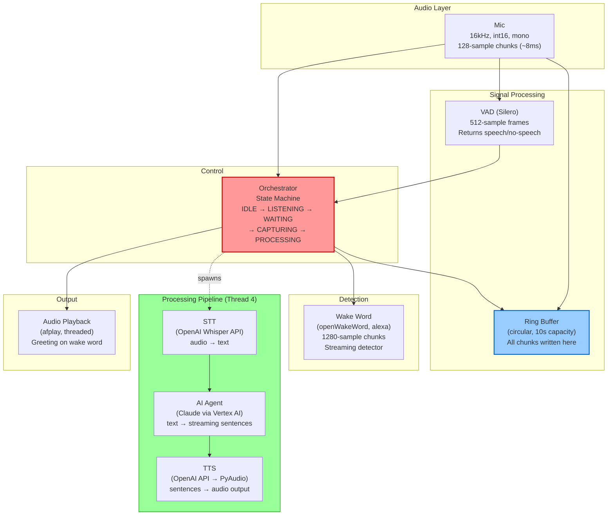

# Voice Assistant — Component & Data Flow

## Architecture

```
Mic (128 samples, 8ms) → Ring Buffer (write all)
                        → VAD (Silero, 512-sample frames)
                        → Event Queue (every chunk + VAD result when available)
                        → Orchestrator (state machine)
                            → Wake Word (openWakeWord, alexa model)
                            → Audio Playback (afplay, greeting)
                            → Processing thread:
                                STT (Whisper API) → AI Agent (Claude) → TTS (OpenAI)
```

## Component Diagram



## Data Flow Per Chunk

1. AudioCapture reads 128 samples from mic (~8ms, blocks waiting for hardware)
2. Chunk written to ring buffer (always)
3. Chunk fed to VAD accumulator
4. VAD returns result every 4th chunk (512 samples accumulated), None otherwise
5. `(vad_result_or_None, chunk)` put in event queue
6. Orchestrator receives every chunk:
   - IDLE: only looks at VAD results, counts consecutive speech
   - LISTENING: feeds every chunk to wake word model + tracks silence via VAD
   - WAITING_FOR_USER: only looks at VAD results
   - CAPTURING: records every chunk, uses VAD for silence detection
   - PROCESSING: listens for wake word (interrupt), same lookback pattern as LISTENING

## Data Formats

```
Mic → Event Queue:       int16 numpy array, 128 samples
Ring Buffer storage:     int16 numpy array, circular
VAD input:               float32 (converted internally), 512 samples
VAD output:              VADResult(is_speech: bool, confidence: float) or None
Wake Word input:         int16 numpy array, 1280-sample chunks (accumulated internally)
Wake Word output:        bool (detected or not)
Captured recording:      list[int16 numpy arrays], variable length
STT input → output:      WAV bytes (16-bit PCM, 16kHz, mono) → str
AI Agent input → output: str → Iterator[str] (streamed sentence by sentence)
TTS input → output:      str → PCM stream (24kHz, 16-bit, mono) direct to PyAudio
```

## Swappable Components

STT, AI Agent, and TTS are defined as `typing.Protocol` interfaces.
Swap implementations by changing one line in `run.py`.
