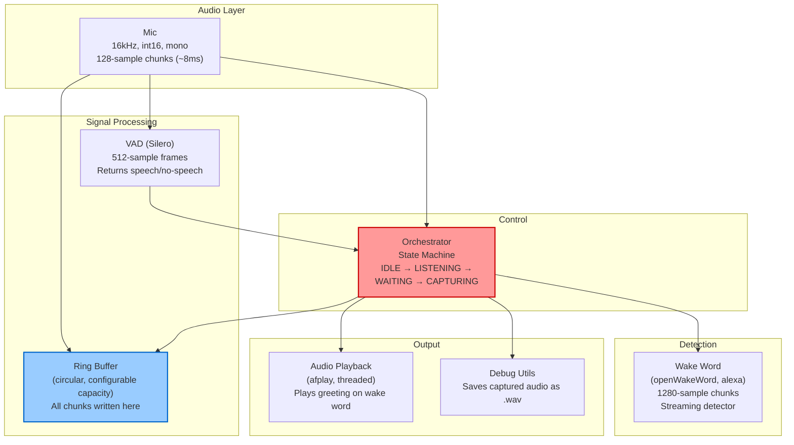

# Voice Assistant — Component & Data Flow

## Current Architecture

```
Mic (128 samples, 8ms) → Ring Buffer (write all)
                        → VAD (Silero, 512-sample frames)
                        → Event Queue (every chunk + VAD result when available)
                        → Orchestrator (state machine)
                            → Wake Word (openWakeWord, alexa model)
                            → Audio Playback (afplay, greeting)
                            → Debug Utils (save .wav captures)
```

## Component Diagram



## Data Flow Per Chunk

1. AudioCapture reads 128 samples from mic
2. Chunk written to ring buffer (always)
3. Chunk fed to VAD accumulator
4. VAD returns result every 4th chunk (512 samples accumulated)
5. `(vad_result_or_None, chunk)` put in event queue
6. Orchestrator receives every chunk:
   - IDLE: only looks at VAD results, counts consecutive speech
   - LISTENING: feeds every chunk to wake word model
   - WAITING_FOR_USER: only looks at VAD results
   - CAPTURING: records every chunk, uses VAD for silence detection

## Data Formats

```
Mic → Event Queue:    int16 numpy array, 128 samples
Ring Buffer storage:  int16 numpy array, circular
VAD input:            float32 (converted internally), 512 samples
VAD output:           VADResult(is_speech: bool, confidence: float)
Wake Word input:      int16 numpy array, 1280-sample chunks (accumulated internally)
Wake Word output:     bool (detected or not)
Captured recording:   list[int16 numpy arrays], variable length
Debug .wav output:    16-bit PCM, 16kHz, mono
```

## Threading Model

```
Thread 1 (Audio I/O):     mic.read() → ring_buffer.write() → vad.process() → queue.put()
Thread 2 (Main/Orch):     queue.get() → orchestrator.on_audio()
Thread 3 (Playback):      afplay subprocess (spawned on wake word, daemon thread)
```

## Future Components (Not Yet Implemented)

- **STT**: faster-whisper or API-based (converts captured audio → text)
- **LLM**: Claude API via Anthropic SDK (text → response)
- **TTS**: Response audio playback (text → speech)
- **AEC**: Acoustic echo cancellation (needed if we want interrupt detection during TTS)
- **Tool Executor**: External API calls triggered by LLM
