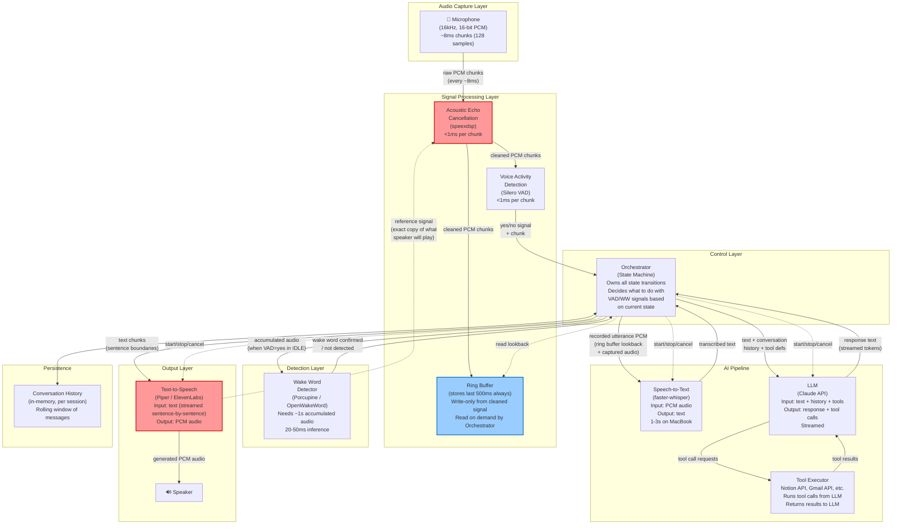

# Voice Assistant — Component & Data Flow

What are the pieces, what data flows between them, and in what format.
The critical detail here is the AEC feedback loop and the ring buffer.

## Full Component Diagram



## Data Format at Each Edge

```
┌─────────────────────────┬───────────────────────────────────────────────┐
│ Edge                    │ Data Format                                  │
├─────────────────────────┼───────────────────────────────────────────────┤
│ Mic → AEC               │ PCM int16[], 16kHz, mono, 128-sample chunks  │
│ AEC → Ring Buffer        │ Same PCM format, echo removed               │
│ AEC → VAD                │ Same PCM format                              │
│ TTS → AEC (reference)    │ Same PCM format (what speaker is playing)    │
│ VAD → Orchestrator       │ (bool: speech_detected, float: confidence)   │
│ Orchestrator → WakeWord  │ PCM buffer (~1s accumulated)                 │
│ WakeWord → Orchestrator  │ (bool: detected, str: which_word)            │
│ Orchestrator → STT       │ PCM int16[], variable length (1-30s)         │
│ STT → Orchestrator       │ str (transcribed text)                       │
│ Orchestrator → LLM       │ messages[] + tools[] (JSON, Claude API fmt)  │
│ LLM → Orchestrator       │ streamed text chunks + tool_use blocks       │
│ Orchestrator → TTS       │ str (sentence-sized text chunks)             │
│ TTS → Speaker            │ PCM float32[], played via sounddevice        │
│ Ring Buffer (read)       │ PCM int16[], last N ms on demand             │
└─────────────────────────┴───────────────────────────────────────────────┘
```

## The AEC Feedback Loop (Detail)

This is the most non-obvious part of the architecture.
Without it, the system hears itself and enters chaos.

```
                YOU CONTROL THIS                          YOU DON'T CONTROL THIS
         ┌─────────────────────────┐              ┌──────────────────────────────┐
         │                         │              │                              │
         │   TTS generates PCM ────┼──→ Speaker ──┼──→ Sound waves ──→ Walls ──→ │
         │         │               │              │     reflections, delays,     │
         │         │ exact copy    │              │     frequency distortion     │
         │         ▼               │              │              │               │
         │   AEC reference input   │              │              ▼               │
         │         │               │              │     Mic picks up:            │
         │         │               │              │       echo(TTS) + user + noise│
         │         ▼               │              │              │               │
         │   AEC subtracts         │◄─────────────┼──────────────┘               │
         │   estimated echo        │   mic signal │                              │
         │         │               │              │                              │
         │         ▼               │              │                              │
         │   Cleaned signal ≈      │              │                              │
         │   user voice + noise    │              │                              │
         │   (TTS ~95% removed)    │              │                              │
         └─────────────────────────┘              └──────────────────────────────┘

    Why "estimated" and not exact subtraction?
    Because the mic doesn't hear the TTS signal exactly as generated.
    The sound bounces off walls, gets delayed by a few ms, loses some
    frequencies. AEC uses an adaptive filter that learns the room's
    acoustic profile over time. First few seconds are worst; it
    improves as it "hears" more of the room's echo pattern.
```

## Threading Model

```
┌─────────────────────────────────────────────────────────┐
│ Thread 1: Audio I/O (real-time priority)                │
│   while True:                                           │
│       chunk = mic.read(128)         # blocks ~8ms       │
│       cleaned = aec.process(chunk)  # <1ms              │
│       ring_buffer.write(cleaned)    # <0.1ms            │
│       vad_result = vad(cleaned)     # <1ms              │
│       event_queue.put(vad_result)   # non-blocking      │
│                                                         │
│   This thread NEVER blocks on anything except mic.read  │
│   Total per-loop: ~10ms. Must keep up with mic rate.    │
└─────────────────────────────────────────────────────────┘

┌─────────────────────────────────────────────────────────┐
│ Thread 2: Orchestrator (main logic)                     │
│   while True:                                           │
│       vad_event = event_queue.get()  # blocks           │
│       match self.state:                                 │
│           case IDLE:                                    │
│               if vad_event.speech:                      │
│                   feed_to_wakeword(...)                 │
│           case WAITING_FOR_USER:                        │
│               if vad_event.speech:                      │
│                   start_capture(ring_buffer.lookback()) │
│           case CAPTURING:                               │
│               ... (see state machine)                   │
│           case PROCESSING:                              │
│               ... (check for interrupt)                 │
└─────────────────────────────────────────────────────────┘

┌─────────────────────────────────────────────────────────┐
│ Thread 3: AI Pipeline (spawned on demand)               │
│   audio = captured_utterance                            │
│   text = whisper.transcribe(audio)      # 1-3s          │
│   response = claude.stream(text, ...)   # 1-5s          │
│   for sentence in response:                             │
│       tts_audio = tts.synthesize(sentence)              │
│       aec.set_reference(tts_audio)      # CRITICAL      │
│       speaker.play(tts_audio)                           │
│       if interrupted: break                             │
└─────────────────────────────────────────────────────────┘
```

## What the Orchestrator Owns

The orchestrator is the brain. It:
- Owns the state machine (current state + transitions)
- Reads from the event queue (VAD results)
- Reads from the ring buffer (lookback audio)
- Spawns/cancels Thread 3 (AI pipeline)
- Tells AEC when TTS reference signal is available
- Manages conversation history
- Decides multi-turn vs. end-of-conversation
