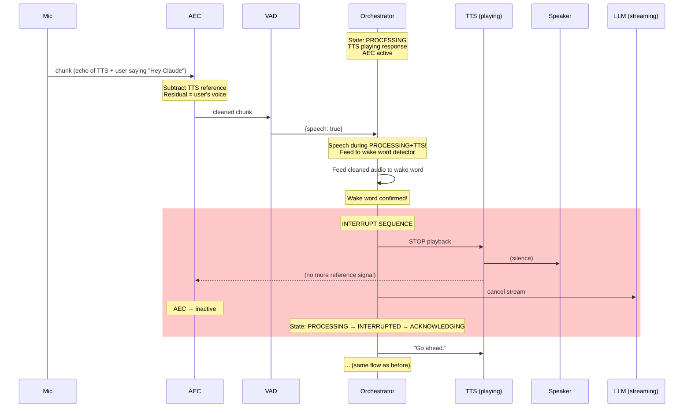

# Voice Assistant — Sequence Diagram (Happy Path)

Full walk-through: user says wake word → asks a question → gets an answer.
Every timing detail, every buffer operation, every state transition.

## Happy Path: "Hey Claude, what does empiricism mean?"

```mermaid
sequenceDiagram
    participant MIC as Mic (8ms chunks)
    participant AEC as AEC
    participant RB as Ring Buffer
    participant VAD as VAD
    participant WW as Wake Word
    participant ORCH as Orchestrator
    participant STT as STT (Whisper)
    participant LLM as LLM (Claude)
    participant TTS as TTS
    participant SPK as Speaker

    Note over ORCH: State: IDLE<br/>AEC: inactive

    rect rgb(240, 240, 240)
        Note over MIC, VAD: Continuous background loop (every ~8ms)
        loop Every 8ms chunk
            MIC->>AEC: raw PCM chunk
            Note over AEC: AEC inactive (no TTS ref)<br/>passes through unchanged
            AEC->>RB: cleaned chunk (write)
            AEC->>VAD: cleaned chunk
            VAD->>ORCH: {speech: false}
            Note over ORCH: No speech → do nothing
        end
    end

    Note over MIC: User says "Hey Claude"<br/>but sound starts ~200ms<br/>before VAD detects it

    rect rgb(255, 255, 220)
        Note over MIC, ORCH: Wake word detection sequence
        MIC->>AEC: chunk (contains start of "Hey...")
        AEC->>RB: written to ring buffer (this audio is preserved!)
        AEC->>VAD: chunk
        VAD->>ORCH: {speech: true, confidence: 0.92}

        Note over ORCH: State still IDLE<br/>VAD=yes → feed accumulated<br/>audio to wake word model

        ORCH->>RB: read last ~1s of audio
        RB-->>ORCH: ~1s PCM buffer
        ORCH->>WW: ~1s accumulated audio
        Note over WW: Processing...<br/>~30ms inference

        loop 3-4 more chunks while WW processes
            MIC->>AEC: chunk (more of "Hey Claude")
            AEC->>RB: written
            AEC->>VAD: chunk
            VAD->>ORCH: {speech: true}
            Note over ORCH: Already sent to WW,<br/>accumulating more audio
        end

        WW-->>ORCH: {detected: true, word: "hey_claude"}
    end

    rect rgb(220, 255, 220)
        Note over ORCH: State: IDLE → ACKNOWLEDGING
        ORCH->>TTS: "Go ahead."
        TTS->>SPK: PCM audio (plays "Go ahead")
        TTS-->>AEC: reference signal (same PCM)
        Note over AEC: AEC now ACTIVE<br/>subtracting TTS from mic input

        loop During "Go ahead" playback (~600ms)
            MIC->>AEC: chunk (contains echo of "Go ahead")
            Note over AEC: Subtract TTS reference<br/>→ residual ≈ silence
            AEC->>RB: cleaned (mostly silence)
            AEC->>VAD: cleaned
            VAD->>ORCH: {speech: false}
            Note over ORCH: VAD ignored in<br/>ACKNOWLEDGING anyway
        end

        Note over SPK: "Go ahead" playback done
        Note over AEC: AEC reference exhausted<br/>→ AEC effectively inactive
        Note over ORCH: State: ACKNOWLEDGING → WAITING_FOR_USER<br/>Start 15s timeout
    end

    rect rgb(240, 240, 240)
        Note over MIC, ORCH: Silence while user formulates question (~2s)
        loop ~250 chunks of silence
            MIC->>AEC: chunk (silence/ambient)
            AEC->>RB: written
            AEC->>VAD: chunk
            VAD->>ORCH: {speech: false}
            Note over ORCH: No speech yet,<br/>timeout counting...
        end
    end

    rect rgb(220, 220, 255)
        Note over MIC: User starts: "What does empiri-"<br/>Speech starts HERE but VAD<br/>won't detect for ~200ms

        loop ~25 chunks before VAD triggers
            MIC->>AEC: chunk (faint start of speech)
            AEC->>RB: written ← THIS AUDIO IS SAVED
            AEC->>VAD: chunk
            VAD->>ORCH: {speech: false}
            Note over ORCH: VAD hasn't triggered yet<br/>but ring buffer has the audio!
        end

        MIC->>AEC: chunk (speech now clear)
        AEC->>RB: written
        AEC->>VAD: chunk
        VAD->>ORCH: {speech: true}

        Note over ORCH: State: WAITING_FOR_USER → CAPTURING<br/>Grab ring buffer lookback!

        ORCH->>RB: read last 300ms
        RB-->>ORCH: lookback audio (contains "What does")
        Note over ORCH: Start recording:<br/>lookback + live chunks

        loop User continues speaking (~3s)
            MIC->>AEC: chunk
            AEC->>RB: written
            AEC->>VAD: chunk
            VAD->>ORCH: {speech: true}
            Note over ORCH: Append chunk to<br/>recording buffer
        end

        Note over MIC: User stops speaking

        loop Silence detection (~2s)
            MIC->>AEC: chunk (silence)
            AEC->>RB: written
            AEC->>VAD: chunk
            VAD->>ORCH: {speech: false}
            Note over ORCH: Silence counter: N/250<br/>(need ~250 chunks = ~2s)
        end

        Note over ORCH: 2s continuous silence confirmed<br/>State: CAPTURING → PROCESSING
    end

    rect rgb(255, 230, 220)
        Note over ORCH, LLM: AI Pipeline

        ORCH->>STT: complete utterance audio<br/>(lookback + captured)
        Note over STT: Whisper processing...<br/>~2s on MacBook
        STT-->>ORCH: "What does empiricism mean?"

        ORCH->>LLM: messages: [{role: user,<br/>content: "What does empiricism mean?"}]<br/>+ conversation history
        Note over LLM: Claude API streaming...<br/>~2s to first token

        loop Streamed response (sentence-by-sentence)
            LLM-->>ORCH: "Empiricism is the philosophical position that"
            ORCH->>TTS: first sentence
            TTS->>SPK: PCM audio
            TTS-->>AEC: reference signal
            Note over AEC: AEC active again

            loop During this sentence's TTS (~3s)
                MIC->>AEC: chunk (TTS echo + ambient)
                Note over AEC: Subtract TTS reference
                AEC->>RB: cleaned
                AEC->>VAD: cleaned
                VAD->>ORCH: {speech: false}
                Note over ORCH: No interrupt detected,<br/>continue playback
            end

            LLM-->>ORCH: "knowledge comes primarily from sensory experience."
            ORCH->>TTS: second sentence
            TTS->>SPK: PCM audio
            TTS-->>AEC: reference signal
        end

        Note over SPK: Response playback done
        Note over AEC: AEC → inactive
        Note over ORCH: State: PROCESSING → WAITING_FOR_USER<br/>(multi-turn: wait for follow-up)
    end

    rect rgb(240, 240, 240)
        Note over ORCH: Waiting for follow-up...<br/>15s timeout running
        Note over ORCH: If user speaks → CAPTURING again<br/>If timeout → IDLE
    end
```



## Interrupt Path (Alternate Flow)

What happens if the user says "Hey Claude" during AI's TTS response:



## Timing Budget (Happy Path)

```
Event                                   Wall clock (cumulative)
──────────────────────────────────────────────────────────────
User says "Hey Claude"                  t = 0ms
VAD detects speech                      t ≈ 200ms
Wake word model confirms                t ≈ 250ms
"Go ahead" TTS starts playing           t ≈ 350ms      ← user hears response
"Go ahead" TTS finishes                 t ≈ 950ms
                                        
User starts speaking question           t ≈ 2000ms     (user thinks for ~1s)
VAD detects speech                      t ≈ 2200ms
User finishes speaking                  t ≈ 5000ms     (~3s utterance)
Silence threshold reached               t ≈ 7000ms     (2s of silence)
                                        
STT completes                           t ≈ 9000ms     (~2s Whisper)
LLM first token                         t ≈ 11000ms    (~2s API latency)
First sentence ready for TTS            t ≈ 12000ms
TTS starts playing first sentence       t ≈ 12500ms    ← user hears answer

Total: ~12.5s from wake word to hearing the answer.
Of which ~5s is the user speaking + silence detection.
Actual system latency: ~5.5s (STT + LLM + TTS start).

Optimization opportunities:
- Streaming STT (Deepgram): save ~1.5s (transcribe while user speaks)
- Faster LLM (Claude Haiku): save ~1s on first token
- Reduce silence threshold to 1.5s: save 0.5s
- Pre-warm TTS: save ~0.3s
Best case with all optimizations: ~8s total, ~3s system latency.
```
