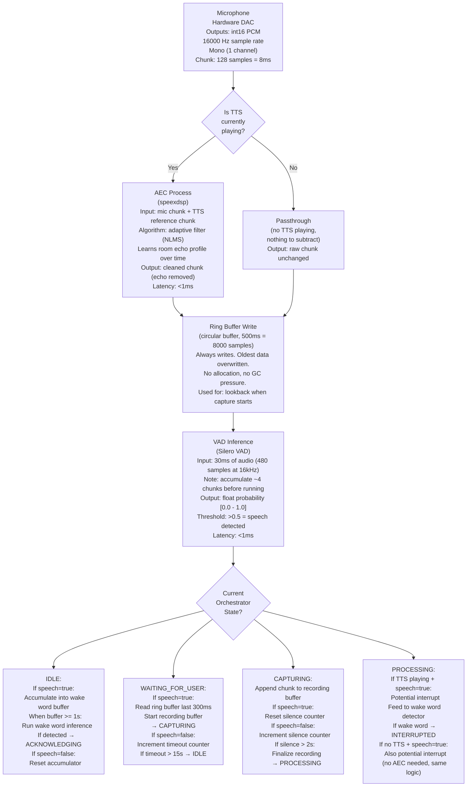

# Voice Assistant — Audio Signal Flow

What happens to the audio data, byte by byte, through the system.
This is the "plumbing" view — critical for implementation because
every format mismatch or dropped sample creates bugs you can hear.

## Signal Path (Per Chunk)



## Audio Formats at Each Stage

```
┌──────────────────┬────────────────────────────────────────────────────┐
│ Point in pipeline │ Format Details                                    │
├──────────────────┼────────────────────────────────────────────────────┤
│ Mic output        │ int16 PCM, 16kHz, mono                           │
│                   │ Range: [-32768, 32767]                            │
│                   │ Chunk: 128 samples = 256 bytes = ~8ms             │
│                   │                                                    │
│ AEC input (mic)   │ Same as mic output                                │
│ AEC input (ref)   │ Must match mic format exactly (16kHz int16 mono)  │
│                   │ Must be time-aligned: AEC expects the reference   │
│                   │ chunk that corresponds to what the speaker was     │
│                   │ playing at the same moment the mic chunk arrived.  │
│                   │ In practice: buffer TTS output and feed chunks    │
│                   │ synchronized with mic chunk timestamps.           │
│                   │                                                    │
│ AEC output        │ Same format, echo removed                         │
│                   │                                                    │
│ Ring buffer       │ Stores raw int16 samples (no chunking)            │
│                   │ 500ms = 8000 samples = 16000 bytes                │
│                   │ Read returns: int16 array of requested length     │
│                   │                                                    │
│ VAD input         │ Silero expects: float32 normalized [-1.0, 1.0]    │
│                   │ YOU MUST CONVERT: int16 → float32 / 32768.0       │
│                   │ Silero wants 30ms frames (480 samples at 16kHz)   │
│                   │ Accumulate ~4 mic chunks, then run VAD            │
│                   │                                                    │
│ Wake word input   │ Library-specific. Porcupine: int16, 16kHz         │
│                   │ OpenWakeWord: float32 normalized, 16kHz           │
│                   │ Read the docs. Format mismatch = silent failure.  │
│                   │                                                    │
│ STT input         │ faster-whisper: float32 normalized, 16kHz         │
│                   │ Or: path to a .wav file                           │
│                   │ Convert: int16 array → float32 / 32768.0          │
│                   │                                                    │
│ TTS output        │ Varies by library:                                │
│                   │ Piper: int16 PCM, 22050Hz (must resample to 16k)  │
│                   │ ElevenLabs API: mp3 bytes (must decode)           │
│                   │ For AEC: must convert to same format as mic input │
│                   │                                                    │
│ Speaker input     │ sounddevice: float32 normalized, any sample rate  │
│                   │ Or int16. Set dtype in sd.play() call.            │
└──────────────────┴────────────────────────────────────────────────────┘

    CRITICAL GOTCHA: Sample rate mismatches are the #1 audio bug.
    Mic = 16kHz. TTS might output 22050Hz or 24000Hz.
    AEC reference MUST be resampled to 16kHz before feeding.
    Use librosa.resample() or scipy.signal.resample().
    Get this wrong and AEC produces garbage → VAD fires constantly.
```

## Ring Buffer Implementation Detail

```
Why a ring buffer and not a list/queue:

    List:     append() works, but trimming the front is O(n).
              For 500ms at 16kHz = 8000 samples, this is fine
              perf-wise, but allocates/deallocates memory constantly.
              GC pauses in a real-time audio thread = audio glitches.

    deque:    collections.deque(maxlen=8000) works. Append is O(1),
              old items auto-evict. But reading a slice requires
              iterating (no random access). Fine for Python.

    numpy ring buffer: Pre-allocate np.zeros(8000, dtype=np.int16).
              Write pointer advances, wraps around. Read = two slices
              concatenated. Zero allocation after init. Best option.

    Ring buffer operations:
    
    write(chunk):
        n = len(chunk)
        end = (write_ptr + n) % capacity
        if end > write_ptr:
            buffer[write_ptr:end] = chunk
        else:
            split = capacity - write_ptr
            buffer[write_ptr:] = chunk[:split]
            buffer[:end] = chunk[split:]
        write_ptr = end

    read_last(ms):
        n_samples = int(sample_rate * ms / 1000)
        start = (write_ptr - n_samples) % capacity
        if start < write_ptr:
            return buffer[start:write_ptr].copy()
        else:
            return np.concatenate([buffer[start:], buffer[:write_ptr]])
```

## TTS → AEC Reference Signal Synchronization

```
The hardest audio engineering detail in this system.

Problem:
    AEC needs the reference signal (what the speaker is playing)
    time-aligned with what the mic is hearing. But:
    
    1. Speaker output has hardware latency (~5-20ms on laptops)
    2. Sound travels from speaker to mic (~1-3ms depending on distance)
    3. Total delay: reference signal leads the mic's echo by ~10-25ms
    
Solution:
    Most AEC libraries (speexdsp, WebRTC) handle this internally.
    They maintain an adaptive delay estimator that figures out the
    offset between reference and mic signal. You just need to feed
    both signals chunk-by-chunk, roughly time-aligned.
    
    In practice:
    
    # When TTS generates audio, don't feed it to AEC immediately.
    # Feed it as you play it, chunk by chunk, synchronized with
    # mic chunks.
    
    tts_audio = tts.synthesize(sentence)       # full sentence audio
    tts_chunks = split_into_chunks(tts_audio, 128)  # same size as mic
    
    for i, tts_chunk in enumerate(tts_chunks):
        speaker.write(tts_chunk)               # play this chunk
        aec.set_reference(tts_chunk)           # tell AEC what's playing
        # Next mic.read() will pick up the echo of this chunk
        # AEC will subtract it
    
    Note: speaker.write() may buffer internally (ALSA/CoreAudio
    typically buffers 2-4 chunks). This is fine — AEC's adaptive
    filter compensates for the buffering delay. But if you feed
    the entire TTS audio to AEC at once upfront, the time alignment
    is completely wrong and AEC fails.
```
