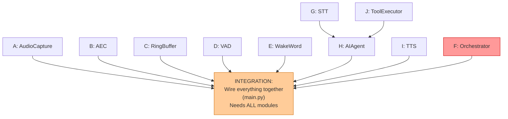

# Voice Assistant — Concurrency Model & Work Breakdown

## The Core Problem You're Identifying

The system has things that MUST run simultaneously:
- Mic capture can never pause (hardware delivers audio whether you read it or not)
- VAD must process every chunk (or you miss interrupts)
- AI pipeline (STT → LLM → Tools → TTS) takes seconds

These are not sequential steps. They are **concurrent loops with shared state**.

---

## Thread Diagram (Who Runs What, When)

This is the diagram you're looking for. Time flows downward.
Each column is a thread. Arrows are data/signals crossing thread boundaries.

```
TIME    THREAD 1: Audio I/O          THREAD 2: Orchestrator          THREAD 3: AI Pipeline
 │      (never stops, never blocks   (event-driven, reacts to        (spawned on demand,
 │       on anything except mic)      signals from Thread 1)          killed on interrupt)
 │
 │      ┌─────────────────────┐
 │      │ mic.read(128)       │
 │      │ aec.process(chunk)  │
 │      │ ring_buf.write()    │
 │      │ vad(chunk)          │
 │      │   result: No        │
 │      └─────────────────────┘
 │               ...repeats...
 │      ┌─────────────────────┐
 │      │ mic.read(128)       │
 │      │ aec.process(chunk)  │
 │      │ ring_buf.write()    │
 │      │ vad(chunk)          │
 │      │   result: YES ──────────→ event_queue.put(SPEECH)
 │      └─────────────────────┘     ┌──────────────────────┐
 │      ┌─────────────────────┐     │ event = queue.get()  │
 │      │ mic.read(128)       │     │ state=IDLE, speech=Y │
 │      │ ...continues...     │     │ → feed to wake word  │
 │      └─────────────────────┘     │ → wake word: YES!    │
 │      ┌─────────────────────┐     │ state → ACKNOWLEDGING│
 │      │ mic.read(128)       │     │                      │
 │      │ ...continues...     │     │ tts.play("Go ahead") │
 │      └─────────────────────┘     │ aec.set_ref(tts_pcm) │ ← AEC ref set HERE
 │      ┌─────────────────────┐     │ ...wait for TTS done │
 │      │ mic.read(128)       │     │ state → WAITING      │
 │      │ aec subtracts TTS!  │     └──────────────────────┘
 │      │ vad(cleaned)=No     │
 │      └─────────────────────┘
 │               ...user thinking...
 │      ┌─────────────────────┐
 │      │ mic.read(128)       │
 │      │ vad(chunk)=YES ─────────→ event_queue.put(SPEECH)
 │      └─────────────────────┘     ┌──────────────────────┐
 │      ┌─────────────────────┐     │ state=WAITING,       │
 │      │ mic.read continues  │     │ speech=Y             │
 │      │ vad=YES ────────────────→ │ grab ring_buf 300ms  │
 │      └─────────────────────┘     │ state → CAPTURING    │
 │      ┌─────────────────────┐     │ append chunks...     │
 │      │ mic.read continues  │     │                      │
 │      │ vad=YES ────────────────→ │ append...            │
 │      └─────────────────────┘     │                      │
 │      ┌─────────────────────┐     │                      │
 │      │ vad=NO  ────────────────→ │ silence_count += 1   │
 │      └─────────────────────┘     │                      │
 │               ...2s silence...   │ silence >= 2s!       │
 │                                  │ state → PROCESSING   │
 │                                  │ SPAWN THREAD 3 ─────────→ ┌───────────────────┐
 │                                  └──────────────────────┘    │ audio = utterance  │
 │      ┌─────────────────────┐                                 │                    │
 │      │ mic.read continues  │                                 │ text = whisper(    │
 │      │ vad=No ─────────────────→ (orchestrator idle,         │   audio)  ~2s      │
 │      └─────────────────────┘      checking for interrupt)    │                    │
 │      ┌─────────────────────┐                                 │ response = claude( │
 │      │ mic.read continues  │                                 │   text)  ~3s       │
 │      │ vad=No ─────────────────→ no interrupt                │                    │
 │      └─────────────────────┘                                 │ for sentence in    │
 │                                                              │   response:        │
 │                                  ┌──────────────────────┐    │   tts_pcm = tts(   │
 │                                  │ Orchestrator receives │←───│     sentence)      │
 │                                  │ TTS_PLAYING signal    │    │   signal(TTS_START)│
 │      ┌─────────────────────┐     │ aec.set_ref(tts_pcm) │    │   speaker.play()   │
 │      │ mic.read(128)       │     └──────────────────────┘    │                    │
 │      │ aec SUBTRACTS tts   │                                 │   ...playing...    │
 │      │ vad(cleaned)=No     ────→ no interrupt                │                    │
 │      └─────────────────────┘                                 │                    │
 │                                                              │                    │
 │      ┌─────────────────────┐                                 │                    │
 │      │ USER INTERRUPTS!    │                                 │                    │
 │      │ aec subtracts tts   │                                 │                    │
 │      │ vad(cleaned)=YES ───────→ interrupt detected!         │                    │
 │      └─────────────────────┘     │ set interrupt_flag ────────→ if interrupted:   │
 │                                  │ state → INTERRUPTED       │   speaker.stop()   │
 │                                  │                           │   break            │
 │                                  │                           │   return            │
 │                                  │                           └───────────────────┘
 │                                  │ (thread 3 exits)                THREAD 3 DEAD
 │                                  │ state → ACKNOWLEDGING
 │                                  │ ...cycle repeats...
```

---

## Shared State: What Crosses Thread Boundaries

This is where bugs live. Every piece of shared state needs a synchronization strategy.

```
┌──────────────────────────────────────────────────────────────────────┐
│                        SHARED STATE MAP                              │
│                                                                      │
│  ┌─────────────────────┐     Thread 1        Thread 2     Thread 3   │
│  │ event_queue          │     WRITES ──────→  READS        -         │
│  │ (thread-safe Queue)  │     (put)           (get)                  │
│  │ Sync: built-in       │                                            │
│  └─────────────────────┘                                             │
│                                                                      │
│  ┌─────────────────────┐     Thread 1        Thread 2     Thread 3   │
│  │ ring_buffer          │     WRITES ──────→  READS        -         │
│  │ (numpy array + ptr)  │     (every chunk)   (on demand)            │
│  │ Sync: Lock           │     acquire lock    acquire lock           │
│  │                      │     for write        for read              │
│  └─────────────────────┘                                             │
│                                                                      │
│  ┌─────────────────────┐     Thread 1        Thread 2     Thread 3   │
│  │ aec_reference        │     READS  ←──────  WRITES ←──── WRITES   │
│  │ (current TTS PCM)    │     (process)       (set_ref)    (set_ref) │
│  │ Sync: Lock           │     When TTS starts, ref is set.          │
│  │                      │     When TTS stops, ref is cleared.        │
│  └─────────────────────┘                                             │
│                                                                      │
│  ┌─────────────────────┐     Thread 1        Thread 2     Thread 3   │
│  │ interrupt_flag       │     -               WRITES ────→ READS     │
│  │ (threading.Event)    │                     (set)        (is_set)  │
│  │ Sync: built-in       │                                            │
│  └─────────────────────┘                                             │
│                                                                      │
│  ┌─────────────────────┐     Thread 1        Thread 2     Thread 3   │
│  │ current_state        │     READS           READS/WRITES -         │
│  │ (enum)               │     (to decide      (transitions)          │
│  │ Sync: Lock           │      VAD behavior)                         │
│  └─────────────────────┘                                             │
│                                                                      │
│  ┌─────────────────────┐     Thread 1        Thread 2     Thread 3   │
│  │ recording_buffer     │     -               WRITES       READS     │
│  │ (list of chunks)     │                     (append)     (consume) │
│  │ Sync: Lock           │                     during       once at   │
│  │                      │                     CAPTURING    start     │
│  └─────────────────────┘                                             │
│                                                                      │
│  RULE: Thread 1 never blocks on a Lock for more than ~1ms.           │
│  If a lock is contended, Thread 1 uses try_acquire with timeout.     │
│  Dropping a single 8ms chunk is acceptable. Blocking Thread 1        │
│  for 100ms causes audible glitches and lost audio.                   │
│                                                                      │
└──────────────────────────────────────────────────────────────────────┘
```

---

## Why Threads, Not Async

You asked about async. Here's why threads are the right choice here:

```
┌─────────────────────────────────────────────────────────────────┐
│                                                                  │
│  asyncio (cooperative multitasking):                             │
│    - One thread. Tasks take turns at "await" points.             │
│    - Great for: network I/O (HTTP calls, WebSockets)             │
│    - Problem: mic.read() BLOCKS. It doesn't "await".             │
│      While mic.read() blocks, NOTHING else runs.                 │
│      No VAD, no orchestrator, no interrupt detection.            │
│    - Problem: whisper.transcribe() BLOCKS for 2 seconds.         │
│      During those 2s, mic data is lost.                          │
│                                                                  │
│  threads (preemptive multitasking):                              │
│    - Multiple threads. OS switches between them.                 │
│    - mic.read() blocks Thread 1? Thread 2 still runs.            │
│    - whisper runs in Thread 3? Thread 1 still captures audio.    │
│    - Downside: shared state needs locks.                         │
│    - Python GIL caveat: CPU-bound Python code doesn't truly      │
│      parallelize. BUT: mic.read(), whisper (C extension),        │
│      speexdsp (C extension), HTTP calls — all release the GIL.  │
│      So in practice, true parallelism where it matters.          │
│                                                                  │
│  Hybrid (what we use):                                           │
│    - Thread 1: audio I/O (blocking reads, C extensions)          │
│    - Thread 2: orchestrator (mostly waiting on queue)             │
│    - Thread 3: AI pipeline — could internally use asyncio         │
│      for the Claude API call (streaming HTTP), but thread is     │
│      simpler and sufficient.                                     │
│                                                                  │
└─────────────────────────────────────────────────────────────────┘
```

---

## Work Breakdown: Separable Modules

This is how you split it for a team. Each box is an independent
module with a clean interface. People can work in parallel.

```
┌─────────────────────────────────────────────────────────────────────────┐
│                       WORK BREAKDOWN                                    │
│                                                                         │
│  Each module has:                                                       │
│    - Clear INPUT type                                                   │
│    - Clear OUTPUT type                                                  │
│    - Can be tested independently with fake/recorded data                │
│    - No dependency on other modules' internals                          │
│                                                                         │
│                                                                         │
│  MODULE A: AudioCapture                              Person: ________   │
│  ─────────────────────────────────────                                  │
│  Responsibility: Read mic, produce PCM chunks                           │
│  Interface:                                                             │
│    class AudioCapture:                                                  │
│        def start(self, callback: Callable[[np.ndarray], None])          │
│        def stop(self)                                                   │
│    callback receives int16 numpy array, 128 samples, every ~8ms        │
│  Test: play a .wav file through virtual mic, verify chunks arrive       │
│  Dependencies: sounddevice or pyaudio                                   │
│  Estimated effort: S (small)                                            │
│                                                                         │
│                                                                         │
│  MODULE B: AcousticEchoCanceller                     Person: ________   │
│  ─────────────────────────────────────                                  │
│  Responsibility: Subtract known TTS signal from mic signal              │
│  Interface:                                                             │
│    class AcousticEchoCanceller:                                         │
│        def set_reference(self, tts_chunk: np.ndarray)                   │
│        def clear_reference(self)                                        │
│        def process(self, mic_chunk: np.ndarray) -> np.ndarray           │
│  Test: play TTS through speaker, record with mic, verify AEC output     │
│        has reduced echo. Quantify: measure energy before/after.         │
│  Dependencies: speexdsp                                                 │
│  Estimated effort: M (medium — AEC tuning is fiddly)                    │
│  Gotchas: sample rate must match, reference must be time-aligned        │
│                                                                         │
│                                                                         │
│  MODULE C: RingBuffer                                Person: ________   │
│  ─────────────────────────────────────                                  │
│  Responsibility: Store last N ms of audio, zero-allocation writes       │
│  Interface:                                                             │
│    class RingBuffer:                                                    │
│        def __init__(self, capacity_ms: int, sample_rate: int)           │
│        def write(self, chunk: np.ndarray)                               │
│        def read_last(self, ms: int) -> np.ndarray                      │
│  Test: write known data, read back, verify correctness at wrap-around   │
│  Dependencies: numpy only                                               │
│  Estimated effort: S (small — but wrap-around edge cases are tricky)    │
│                                                                         │
│                                                                         │
│  MODULE D: VoiceActivityDetector                     Person: ________   │
│  ─────────────────────────────────────                                  │
│  Responsibility: Determine if audio chunk contains speech               │
│  Interface:                                                             │
│    class VoiceActivityDetector:                                         │
│        def process(self, chunk: np.ndarray) -> VADResult                │
│                                                                         │
│    @dataclass                                                           │
│    class VADResult:                                                     │
│        is_speech: bool                                                  │
│        confidence: float   # 0.0 to 1.0                                │
│  Note: accumulates chunks internally (Silero wants 30ms frames)        │
│  Test: feed recorded speech + silence, verify correct labels            │
│  Dependencies: silero-vad (torch)                                       │
│  Estimated effort: S (small — wrapper around Silero)                    │
│                                                                         │
│                                                                         │
│  MODULE E: WakeWordDetector                          Person: ________   │
│  ─────────────────────────────────────                                  │
│  Responsibility: Detect specific wake phrase in audio                   │
│  Interface:                                                             │
│    class WakeWordDetector:                                              │
│        def process(self, audio_buffer: np.ndarray) -> bool              │
│  Note: needs ~1s of accumulated audio per call                          │
│  Test: record yourself saying wake word 50 times + 50 non-wake-words    │
│        measure precision/recall                                         │
│  Dependencies: pvporcupine or openwakeword                              │
│  Estimated effort: S-M                                                  │
│                                                                         │
│                                                                         │
│  MODULE F: Orchestrator                              Person: ________   │
│  ─────────────────────────────────────                                  │
│  Responsibility: State machine. Receives events, manages transitions.   │
│  Interface:                                                             │
│    class Orchestrator:                                                  │
│        def __init__(self, config: OrchestratorConfig)                   │
│        def on_vad_event(self, result: VADResult)                        │
│        def on_wakeword_event(self, detected: bool)                      │
│        def on_pipeline_done(self, response: str)                        │
│        def on_pipeline_tts_start(self, tts_pcm: np.ndarray)            │
│        @property                                                        │
│        def state(self) -> State                                         │
│  This is the HARDEST module. It's pure logic (no I/O) but complex.     │
│  Test: unit test every state transition with fake events.               │
│        Use a state transition table as the test fixture.                │
│  Dependencies: none (pure Python)                                       │
│  Estimated effort: L (large — many edge cases)                          │
│                                                                         │
│                                                                         │
│  MODULE G: SpeechToText                              Person: ________   │
│  ─────────────────────────────────────                                  │
│  Responsibility: Convert audio to text                                  │
│  Interface:                                                             │
│    class SpeechToText:                                                  │
│        def transcribe(self, audio: np.ndarray) -> str                   │
│  Test: feed recorded utterances, verify transcription accuracy          │
│  Dependencies: faster-whisper                                           │
│  Estimated effort: S (wrapper)                                          │
│                                                                         │
│                                                                         │
│  MODULE H: AIAgent                                   Person: ________   │
│  ─────────────────────────────────────                                  │
│  Responsibility: LLM conversation + tool calling loop                   │
│  Interface:                                                             │
│    class AIAgent:                                                       │
│        def run(self, user_text: str,                                    │
│                on_text_chunk: Callable[[str], None],                    │
│                interrupt_flag: threading.Event                           │
│                ) -> AgentResult                                         │
│                                                                         │
│    @dataclass                                                           │
│    class AgentResult:                                                   │
│        full_response: str                                               │
│        tool_calls_made: list[ToolCall]                                  │
│        was_interrupted: bool                                            │
│  Note: on_text_chunk callback fires per sentence — this is what         │
│        triggers TTS streaming. interrupt_flag checked between           │
│        tool calls and between streamed chunks.                          │
│  Test: mock the LLM API, verify tool calling loop, verify interrupt     │
│  Dependencies: anthropic SDK                                            │
│  Estimated effort: M-L                                                  │
│                                                                         │
│                                                                         │
│  MODULE I: TextToSpeech                              Person: ________   │
│  ─────────────────────────────────────                                  │
│  Responsibility: Convert text to audio, play it, feed AEC reference     │
│  Interface:                                                             │
│    class TextToSpeech:                                                  │
│        def speak(self, text: str,                                       │
│                  on_reference_chunk: Callable[[np.ndarray], None],      │
│                  interrupt_flag: threading.Event)                        │
│        def stop(self)                                                   │
│  Note: on_reference_chunk is called per chunk as it plays.              │
│        Orchestrator hooks this to aec.set_reference().                  │
│  Test: synthesize known text, verify audio plays, verify reference      │
│        chunks are emitted synchronously with playback                   │
│  Dependencies: piper-tts or elevenlabs SDK, sounddevice                 │
│  Estimated effort: M (sync between playback and reference is tricky)    │
│                                                                         │
│                                                                         │
│  MODULE J: ToolExecutor                              Person: ________   │
│  ─────────────────────────────────────                                  │
│  Responsibility: Execute tool calls from LLM (Notion, Gmail, etc.)     │
│  Interface:                                                             │
│    class ToolExecutor:                                                  │
│        def register_tool(self, name: str, handler: Callable)            │
│        def execute(self, tool_call: ToolCall) -> ToolResult             │
│  Test: mock each API, verify correct calls                              │
│  Dependencies: notion-client, google-api-python-client, etc.            │
│  Estimated effort: M per tool integration                               │
│                                                                         │
└─────────────────────────────────────────────────────────────────────────┘
```

## Dependency Graph (What Blocks What)



```
    Key insight: modules A, B, C, D, E, G, I, J can ALL be built in parallel.
    They have no dependencies on each other.
    
    F (Orchestrator) can also be built in parallel — it's pure logic,
    tested with fake events, no real audio needed.
    
    H (AIAgent) needs J (ToolExecutor) as a dependency.
    
    INTEGRATION is the final step: wire all modules together in main.py.
    This is where the threading model lives.
    
    ┌─────────────────────────────────────────────────┐
    │ PARALLEL WORK STREAMS                           │
    │                                                 │
    │ Stream 1: A + B + C + D + E  (audio layer)     │
    │ Stream 2: F                   (logic layer)     │
    │ Stream 3: G + H + J           (AI layer)        │
    │ Stream 4: I                   (output layer)    │
    │                                                 │
    │ All 4 streams converge at INTEGRATION           │
    └─────────────────────────────────────────────────┘
```

## Integration: main.py Skeleton (How Threads Wire Together)

```python
# This is what INTEGRATION looks like.
# Each module is imported and wired.

def main():
    # --- Initialize modules ---
    ring_buffer = RingBuffer(capacity_ms=500, sample_rate=16000)
    aec = AcousticEchoCanceller(sample_rate=16000)
    vad = VoiceActivityDetector(threshold=0.5)
    wake_word = WakeWordDetector(wake_word="hey_claude")
    stt = SpeechToText(model="base")
    tts = TextToSpeech(on_reference_chunk=aec.set_reference)
    tool_executor = ToolExecutor()
    agent = AIAgent(tool_executor=tool_executor)
    
    event_queue = queue.Queue()
    interrupt_flag = threading.Event()

    orchestrator = Orchestrator(
        ring_buffer=ring_buffer,
        wake_word=wake_word,
        event_queue=event_queue,
    )

    # --- Thread 1: Audio I/O ---
    def audio_loop():
        def callback(chunk):               # called every ~8ms
            cleaned = aec.process(chunk)
            ring_buffer.write(cleaned)
            result = vad.process(cleaned)
            event_queue.put(result)         # non-blocking
        
        audio_capture = AudioCapture()
        audio_capture.start(callback)       # blocks forever

    # --- Thread 3: AI Pipeline (spawned by orchestrator) ---
    def ai_pipeline(utterance_audio):
        interrupt_flag.clear()
        text = stt.transcribe(utterance_audio)

        def on_sentence(sentence):
            if not interrupt_flag.is_set():
                tts.speak(sentence,
                          on_reference_chunk=aec.set_reference,
                          interrupt_flag=interrupt_flag)

        result = agent.run(text,
                           on_text_chunk=on_sentence,
                           interrupt_flag=interrupt_flag)
        orchestrator.on_pipeline_done(result)

    # --- Thread 2: Orchestrator (main thread) ---
    orchestrator.set_pipeline_launcher(
        lambda audio: threading.Thread(
            target=ai_pipeline, args=(audio,)
        ).start()
    )
    
    # Start audio thread
    audio_thread = threading.Thread(target=audio_loop, daemon=True)
    audio_thread.start()

    # Orchestrator runs on main thread (event loop)
    orchestrator.run()  # blocks, processes event_queue forever
```

## How Each Person Tests Their Module Independently

```
┌────────────┬──────────────────────────────────────────────────────┐
│ Module     │ How to test without the rest of the system           │
├────────────┼──────────────────────────────────────────────────────┤
│ A: Capture │ Record 5s of audio, save to .wav, verify waveform   │
│ B: AEC     │ Play .wav through speaker, record with mic,         │
│            │ feed both to AEC, measure echo reduction in dB      │
│ C: Ring    │ Write [1,2,3,...100], read last 10, assert [91..100] │
│            │ Test wrap-around: write 500ms + 100ms, read last 50 │
│ D: VAD     │ Feed recorded speech.wav → expect True              │
│            │ Feed recorded silence.wav → expect False             │
│ E: WakeWrd │ Record "Hey Claude" 20x, verify >95% detected       │
│            │ Record "Hey Google" 20x, verify 0% false positive    │
│ F: Orch    │ PURE UNIT TESTS. No audio. Fake events:             │
│            │ send(SPEECH) in IDLE → assert state == feeding WW    │
│            │ send(WAKE_CONFIRMED) → assert state == ACKNOWLEDGING │
│            │ ...test every transition in the state machine        │
│ G: STT     │ Feed known .wav → assert transcript matches          │
│ H: Agent   │ Mock Claude API → verify tool calling loop           │
│            │ Set interrupt_flag mid-stream → verify early exit    │
│ I: TTS     │ Speak "hello" → verify audio plays                  │
│            │ Verify on_reference_chunk called per playback chunk  │
│ J: Tools   │ Mock Notion API → verify note created correctly      │
└────────────┴──────────────────────────────────────────────────────┘
```
